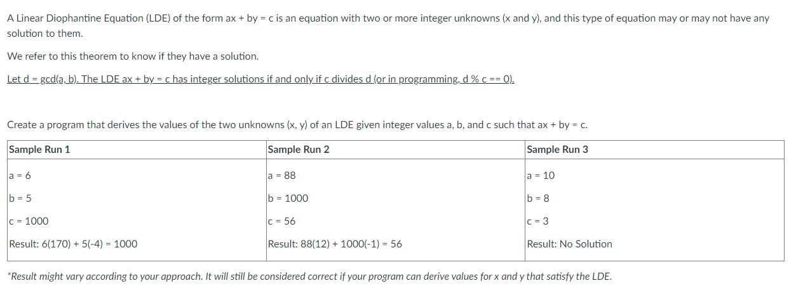

# Linear Diophantine Equation Problem


<details>
<summary>Answer</summary>
<br>

``` c
#include<stdio.h>
int gcd(int a, int b){
	int i;
	if(a > b){
		i = a;
	} else {
		i = b;
	}
	while(i != 1 && (a % i != 0 || b % i != 0)){
		i--;
	}
	return i;
}

void getXandY(int a, int b, int c, int* x, int* y){
	*x = 1;
	*y = -1;
	while(a * (*x) < c){
		(*x)++;
	}
	while(a * (*x) + b *(*y) != c){
		if(a * (*x) + b *(*y) < 0) {
			(*x)++;
			(*y) = -1;
		} else {
			(*y)--;
		}
	}
}
int main(){
	int a, b, c, x, y;
		a = 6;
		b = 9;
		c = 99;
	if(c % gcd(a, b) == 0){
		getXandY(a,b,c, &x, &y);
		printf("%d(%d) + %d(%d) = %d", a, x, b, y, c);
	} else {
		printf("No solution");
	}
	return 0;
}
```

</details>