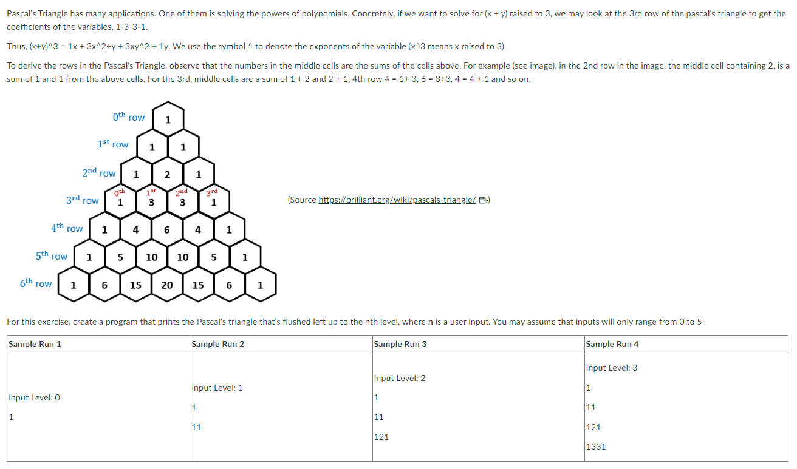

# Pascal's Triangle Problem


<details>
<summary>Answer</summary>
<br>

``` c
#include <stdio.h>
int power(int base, int exp){
	int nRes = 1, i = 0;
	for(i = 0; i < exp; i++){
		nRes *= base;
	}
	return nRes;
}

int getDigit(int x, int nPlace){
	int nRes = 0;
	for(int i = 0; i < nPlace; i++){
		nRes = x / power(10, i) % 10;
	}
	return nRes;
}
int main(){
	int i, j, n, nPrevLine, nCurrNum, nNextLine;
	nPrevLine = 1;
	printf("Level: ");
	scanf("%d", &n);
	printf("%d\n", nPrevLine);
	for(i = 0; i < n; i++){
		nNextLine = 0;
		for(j = 0; j <= i + 1; j++){
			nCurrNum = getDigit(nPrevLine, j) + getDigit(nPrevLine, j + 1);
			nNextLine *= 10;
			nNextLine += nCurrNum;
			printf("%d ", nCurrNum);
		}
		nPrevLine = nNextLine;
		printf("\n");
	}
return 0;
}
```

</details>