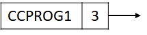

# Introduction

My main objective for this repository is to help CCPROG1 takers have more exercises for them to practice. Websites like Hackerrank or TopCoder assume that you already know the basics of programming. It's hard to look for problems online that are suitable for CCPROG1. I will share some of the exercises given to us and my solutions when I was taking CCPROG1. I hope this helps you pass. Keep practicing!

# How to use this repository

As mentioned by our CCPROG1 professor, try not to look at the answer key as much as possible. Solve it on your own unless you are **REALLY** stuck. It's hard to come up with your solution at first, but it gets easier as you keep practicing. Try to understand the logic rather than memorizing the code. It's all about persistence and patience.

I rated each of the problems in terms of (easiest) 🌚🌘🌗🌖🌕 (hardest), so you will know what type of problem you're dealing with. I also sorted the problems according to topics. Click the folders in the repository to see them.

# How to contribute

Create an issue in this repository requesting to be a contributor, and I will add you to the list. Help me build a library of problems to help CCPROG1 takers practice basic programming and logic formulation.

# CCPROG1 Scope
- Expressions
- Assignment Statement
- Functions
- Pointers
- Conditional Statement
- Iterative Statements
